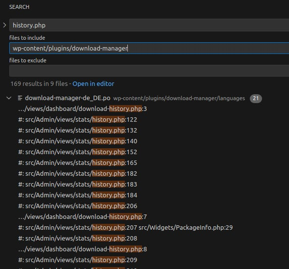

Lỗ hổng trong plugin **Download Manager** trước phiên bản **3.3.24**. Dữ liệu được lấy từ **GET** request được in trực tiếp vào **HTML attribute**, **reflected XSS** xảy ra khi người dùng có đặc quyền truy cập vào đường dẫn do attack cung cấp.

* **CVE ID**: [CVE-2025-10146](https://www.cve.org/CVERecord?id=CVE-2025-10146)
* **Product**: [WordPress Download Manager Plugin](https://wordpress.org/plugins/download-manager)
* **Vulnerability Type**: Cross Site Scripting
* **Affected Versions**: <= 3.3.23
* **CVSS severity**: Medium (7.1)
* **Required Privilege**: Unauthenticated

---

## Requirements

* [**Local WordPress and Debugging**](https://w41bu1.github.io/posts/wordpress-local-and-debugging/)
* **Download Manager**: v3.3.23(vul) và v3.3.24(fix)
* **diff tool**: **meld** hoặc bất cứ tool nào có thể compare để thấy được sự khác biệt giữa 2 version

---

## Analysis

### Patch Diff

Dùng diff tool bất kì để so sánh sự khác biệt giữa bản lỗi và bản vá.
Có sự khác biệt rõ ở file **src/Admin/views/stats/history.php**.

**Bản lỗi**:

```php
<?php if (!empty($user_ids)): ?>
    <div class="clear-filter">
        <?php
        $get_params_xu = $get_params;
        unset($get_params_xu['user_ids']);
        $reset_url = add_query_arg($get_params_xu, 'edit.php');
        ?>
        <a href="<?php echo $reset_url; ?>" class="clear-btn" title="<?php _e('Clear user filter', 'download-manager'); ?>">
            <i class="fas fa-times"></i>
        </a>
    </div>
<?php endif; ?>
```

Lấy **GET params** và gán trực tiếp vào **href** của thẻ `<a>` mà không có cơ chế bảo vệ => nguy cơ **reflected XSS**.

**Bản vá**:

```php
<?php if (!empty($user_ids)): ?>
    <div class="clear-filter">
        <?php
        $get_params_xu = $get_params;
        unset($get_params_xu['user_ids']);
        $get_params_xu = \WPDM\__\__::sanitize_array($get_params_xu, 'safetxt');

        $reset_url = add_query_arg($get_params_xu, 'edit.php');
        ?>
        <a href="<?php echo esc_url($reset_url); ?>" class="clear-btn" title="<?php _e('Clear user filter', 'download-manager'); ?>">
            <i class="fas fa-times"></i>
        </a>
    </div>
<?php endif; ?>
```


Bản vá đã **sanitize** mảng **GET params** bằng `sanitize_array` và sử dụng `esc_url`  để **escape URL** => an toàn hơn.

### How It Work?

Ta cần tìm URL thực sự để inject GET params chứa XSS payload.

**src/Admin/views/stats/history.php** chứa các tag **php**, **HTML** và nằm trong **views** cho thấy file này được include ở nơi nào đó trong mã nguồn plugin.

Ta tìm với từ khóa `history.php` trong thư mục plugin



👉 Không có kết quả nào khớp. Khả năng cao nó được include động như này `{$file_name}.php`. Ta tìm với regex `\{.*\}\.php`:


**src/Admin/views/stats/history.php** được include trong **src/Admin/views/stats.php**

URL thực sự để truy cập được khai báo ở đầu file **stats.php**

```
$base_page_uri = "edit.php?post_type=wpdmpro&page=wpdm-stats";
```

Tương tự **history.php**, **stats.php** cũng được include ở đâu đó trong mã nguồn plugin. Nhưng không cần quan tâm vì ta đã tìm được URL thực sự.

Để chắc chắn hơn, ta đặt **breakpoint** tại vị trí lỗ hổng trong file **src/Admin/views/stats/history.php**, sau đó bắt đầu debug và truy cập URL:

```
edit.php?post_type=wpdmpro&page=wpdm-stats
```


Trước tiên, plugin lấy toàn bộ **GET parameters** vào `$get_params`.

Nếu `$user_ids` không rỗng, plugin sẽ tạo **nút “Clear filter”**. Để làm nút này hoạt động, cần một URL mà **không còn `user_ids`** nữa, nên plugin làm như sau:

```php
$get_params_xu = $get_params;        // copy toàn bộ GET parameters
unset($get_params_xu['user_ids']);   // bỏ user_ids ra khỏi mảng
$reset_url = add_query_arg($get_params_xu, 'edit.php'); // tạo URL mới
```

* `unset($get_params_xu['user_ids'])` => loại bỏ bộ lọc `user_ids` khỏi URL.
* `add_query_arg($get_params_xu, 'edit.php')` > tạo URL mới với các tham số còn lại.

Cuối cùng, URL này được gắn vào nút “Clear filter”:

```php
<a href="<?php echo $reset_url; ?>" class="clear-btn">...</a>
```

**Kết quả:** Khi người dùng nhấn nút, trang sẽ load lại **mà không còn bộ lọc user_ids**, tức là `“clear filter”`.

---

## Exploit

### Detect XSS

Gửi GET request chứa XSS payload:

```http
GET /wp-admin/edit.php?post_type=wpdmpro&page=wpdm-stats&user_ids[0]=1&payload="></a><script>alert(document.domain)</script> HTTP/1.1
```

Ta thêm `"></a>` để đóng thẻ `<a>` sau đó thêm 1 script dể `alert()`


👉 XSS thành công, khi người dùng có đặc quyền truy cập vào URL do attacker cung cấp thì **reflected XSS** xảy ra => Xảy ra đúng kịch bản **Unauthenticated**

---

## Conclusion

Lỗ hổng **CVE-2025-10146** trong plugin **WordPress Download Manager <= 3.3.23** là **reflected XSS**, xảy ra khi dữ liệu từ **GET request** được in trực tiếp vào **HTML attribute** mà không được sanitize hoặc escape. Người dùng có quyền truy cập vào đường dẫn này (admin/author) có thể bị tấn công nếu truy cập URL do attacker tạo.

Bản vá **3.3.24** đã:

1. **Sanitize mảng GET parameters** (`sanitize_array`) để loại bỏ ký tự nguy hiểm.
2. **Escape URL** khi in ra HTML (`esc_url`) để ngăn XSS.

**Key takeaways**:

* Luôn **sanitize và escape dữ liệu** từ người dùng trước khi render ra HTML.
* Kiểm tra **quyền truy cập** trước khi xử lý hoặc hiển thị dữ liệu nhạy cảm.
* Ngay cả các role thấp (contributor) vẫn có thể trở thành điểm tấn công nếu plugin không bảo vệ đúng cách.
* Cập nhật plugin thường xuyên là cách phòng thủ đơn giản nhưng hiệu quả nhất.

---

## References

[Cross-site scripting (XSS) cheat sheet](https://portswigger.net/web-security/cross-site-scripting/cheat-sheet)

[WordPress Download Manager Plugin <= 3.3.24 is vulnerable to Cross Site Scripting (XSS)](https://patchstack.com/database/wordpress/plugin/download-manager/vulnerability/wordpress-download-manager-plugin-3-3-23-reflected-cross-site-scripting-via-user-ids-parameter-vulnerability)

---
